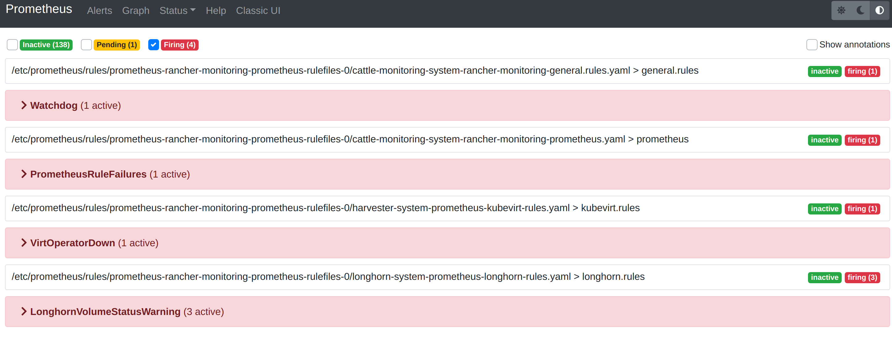
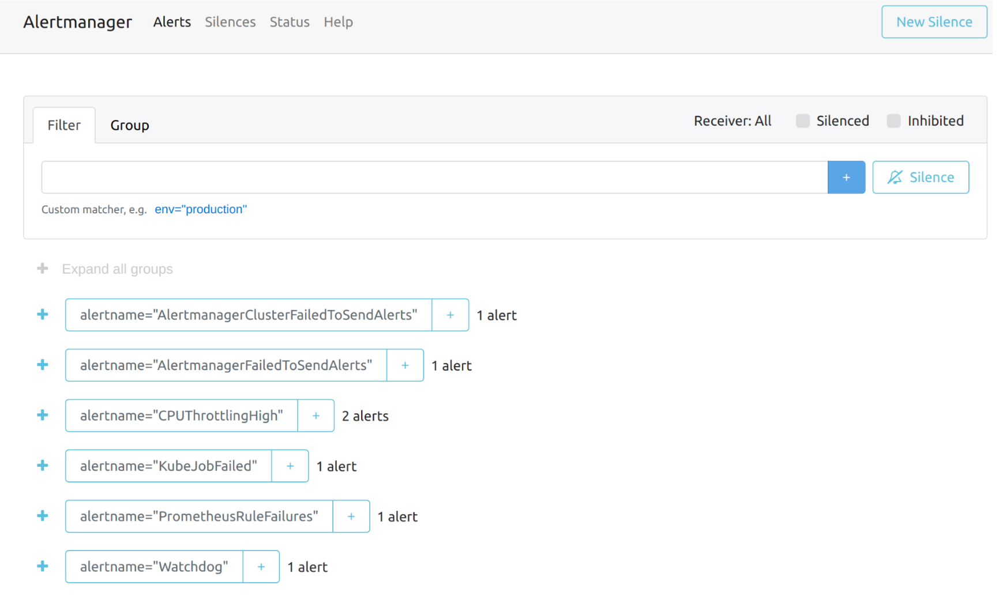
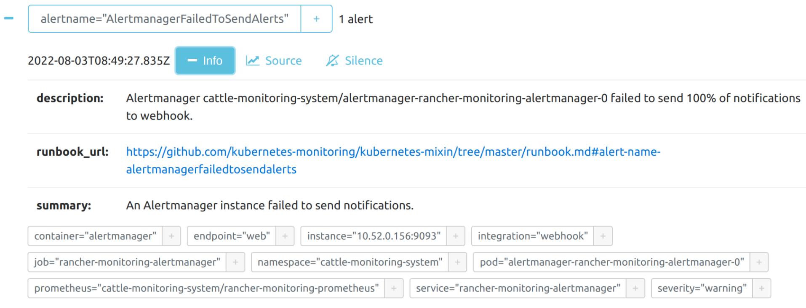
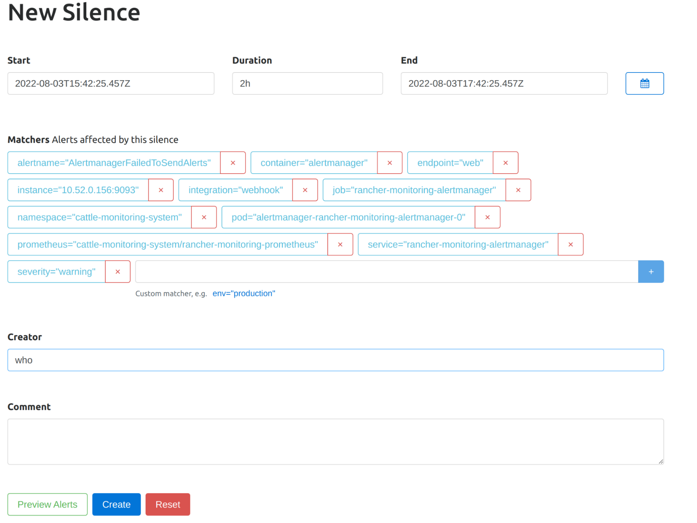
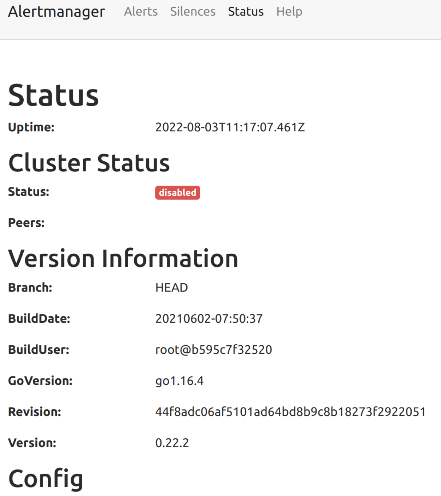
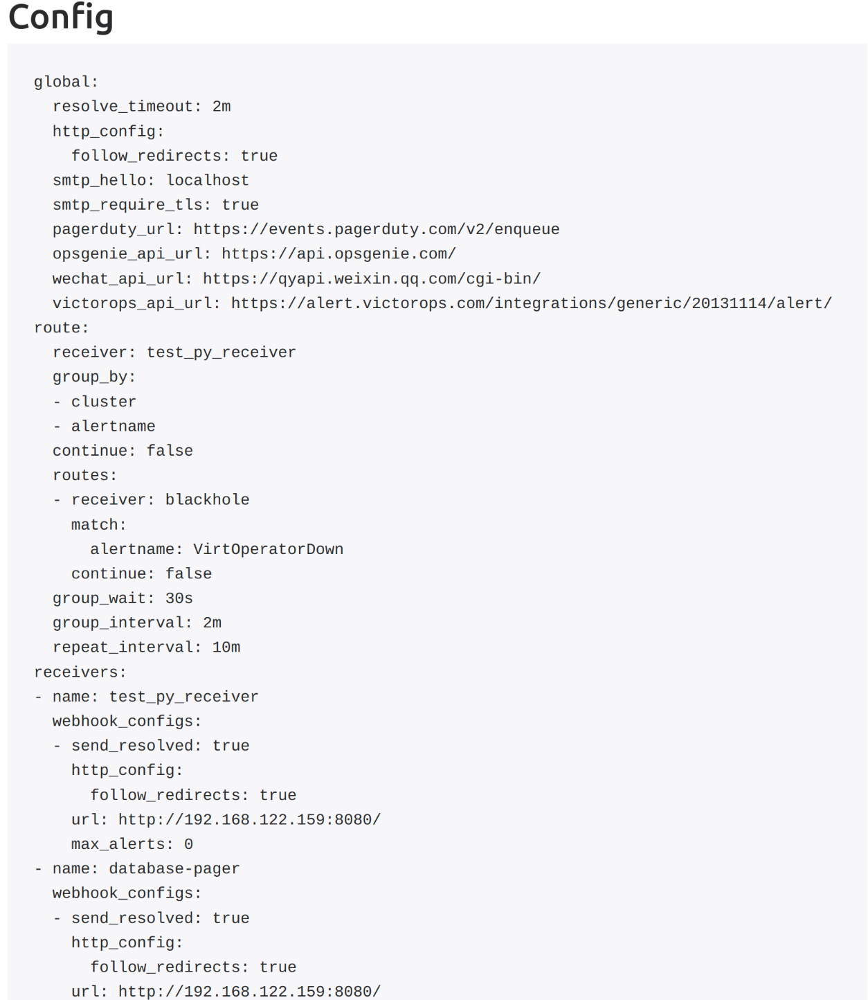
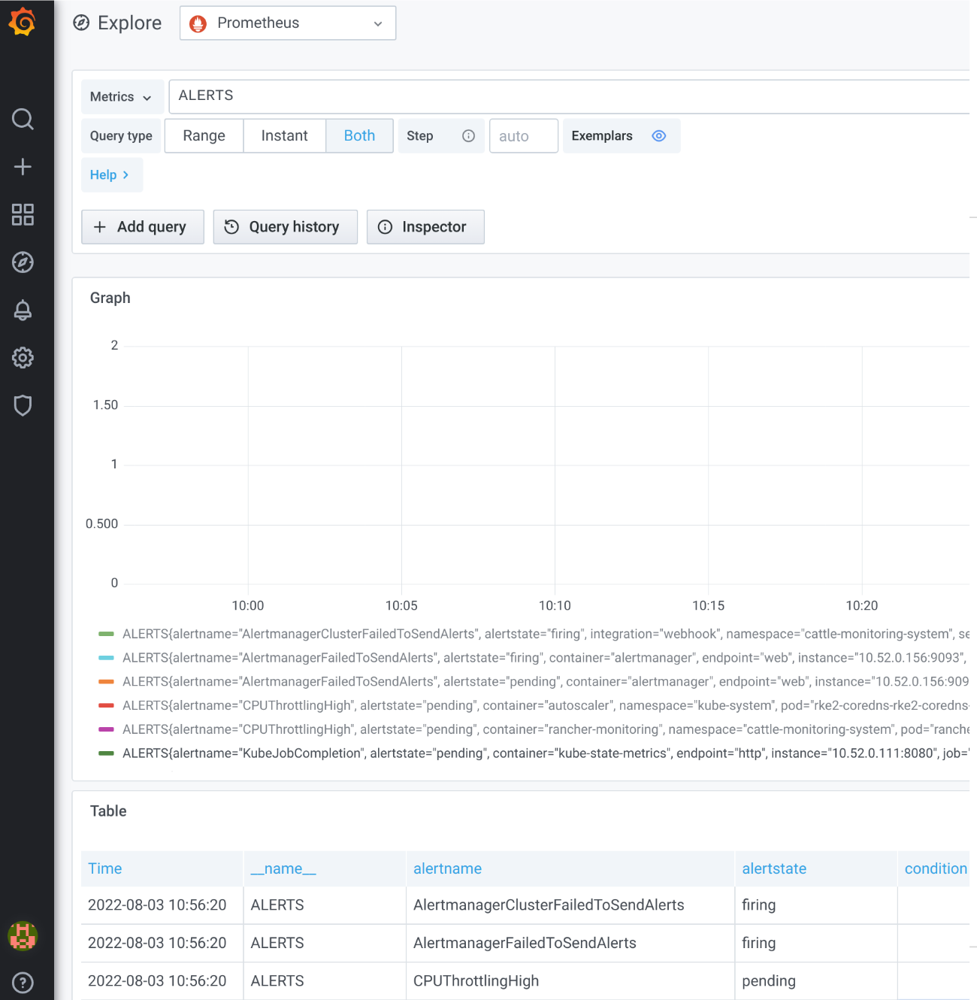
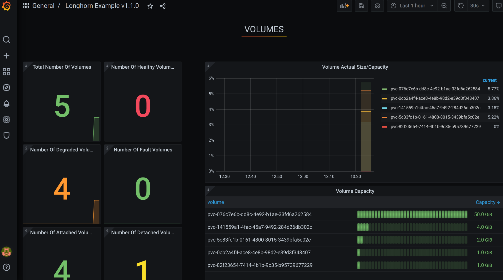

# Cloudweav supports `Alertmanager`

## Summary

Customers wish to enable Prometheus `Alertmanager` in Cloudweav with the ability to configure in UI and API interfaces.

### Related Issues

https://github.com/cloudweav/cloudweav/issues/2517

## Motivation

`Alert` is the very important information for monitoring one running system. Customers can integrate it with other systems to have a well defined lifecycle management.

### Goals

Support `Alertmanager`.

Support config various types of receivers.

Support view and manage alerts from `Alertmanager`s dashboard.

### Non-goals [optional]

Does not support customized alert rules definition.

Does not support customized template files to format alerts

## Proposal

The Cloudweav `Alertmanager` will be achieved via `rancher-monitoring`.

https://github.com/rancher/charts/tree/dev-v2.6/charts/rancher-monitoring/100.1.0%2Bup19.0.3

The `Alertmanager` is disabled by default in Cloudweav as of v1.0.2.

https://github.com/cloudweav/cloudweav-installer/blob/master/pkg/config/templates/rancherd-13-monitoring.yaml#L33

```
      alertmanager:
        enabled: false
```

The `Alertmanager` will be enabled, and the related features will be described in following stories.

### User Stories


#### Story 1

Enable `Alertmanager` by default.

The `Alertmanager` will be enabled in system installation stage, then it is available by default, it can also be disabled after system installation.

The related images will be added to `allow.yaml` in `harveter-installer`, they will be packed into ISO.

Resource usage:Alertmanager has one POD in the cluster, it takes around 50Mi of memory. It is an addon of `Prometheus`, in same namesapce. The raw alert is fired from `Prometheus`, `Alertmanager` get those alert and `takes care of deduplicating, grouping, and routing them to the correct receiver integration such as email, PagerDuty, or OpsGenie. It also takes care of silencing and inhibition of alerts.`. 

Enabling `Alertmanager` by default also keeps a similar user experience as `Prometheus`.

```
# kubectl top pod -A
..
NAMESPACE                   NAME                                                     CPU(cores)   MEMORY(bytes)   

cattle-monitoring-system    alertmanager-rancher-monitoring-alertmanager-0           1m           50Mi            

cattle-monitoring-system    prometheus-rancher-monitoring-prometheus-0               78m          530Mi           
cloudweav-system            cloudweav-756cd66d6d-dcv2g                               23m          375Mi           
cloudweav-system            cloudweav-load-balancer-59bf75f489-sm5kv                 2m           29Mi 
```

#### Story 2

`Alertmanager` is optional to have PVC.

According to quick test, the reload of `Alertmanager` POD can restore the current existing alert. Meanwhile, following topic is useful:

https://github.com/prometheus-community/helm-charts/issues/335#issuecomment-732160419

```
  Persistence is useful for Alertmanager but it will work without.

  When enabled,

  it remembers active/resolved alerts via nflog, so you don't get duplicate Slack notifications etc when restarting without persistence
  it remembers silences
  and probably a few more things
```

`Alertmanager` has an option to set the time duration to retain data, which defaults to `120h`. In some industries, customers may adjust it to tens of days or even more.

```
   retention: 120h
```

When `Alertmanager` is backed by PVC, the recommended default value is `50Gi`.

```
    ## Storage is the definition of how storage will be used by the Alertmanager instances.
    ## ref: https://github.com/prometheus-operator/prometheus-operator/blob/master/Documentation/user-guides/storage.md
    ##
    storage: {}
    # volumeClaimTemplate:
    #   spec:
    ..
    #     resources:
    #       requests:
    #         storage: 50Gi
```

Note: this default value is same with the default storage value of `Prometheus` storage spec, considering it only has difference in comment part, it may be simply copied from `Prometheus`.

https://github.com/rancher/charts/blob/dev-v2.6/charts/rancher-monitoring/100.1.0%2Bup19.0.3/values.yaml#L977

https://github.com/rancher/charts/blob/dev-v2.6/charts/rancher-monitoring/100.1.0%2Bup19.0.3/values.yaml#L2963


In Cloudweav, we may set the PVC default value for `Alertmanager` to 5G. Meanwhile, in https://github.com/cloudweav/cloudweav/issues/2282, we may also set PVC default value for grafana to 5G.

Thus, the minimum resource for Cloudweav is increased from `140G` to `150G`.

https://docs.cloudweavhci.io/v1.0/#hardware-requirements

A proper calculation suggestion is needed in `Cloudweav Doc` for estimating the PVC size and retention days.

As a further enhancement, Cloudweav installer could allow user to set default PVC size for `prometheus`, `grafana`, `alertmanager`, and the possible `logging`. The current hardcoded value is not flexible.

#### Story 3

`Alertmanager` supports main stream receivers.

After `Alertmanager` collects alerts, it can further report alert to various receivers.

The receivers are configured as following.

`route` part defines how to dispatch different type of alert to different receiver.

`receivers` part defines all receivers.

```
  ## Alertmanager configuration directives
  ...
  config:
    global:
      resolve_timeout: 5m
    route:
      group_by: ['job']
      group_wait: 30s
      group_interval: 5m
      repeat_interval: 12h
      receiver: 'null'
      routes:
      - match:
          alertname: Watchdog
        receiver: 'null'
    receivers:
    - name: 'null'
    templates:
    - '/etc/alertmanager/config/*.tmpl'
```

As of July 2022, `Alertmanager` supports following type of receivers.

https://prometheus.io/docs/alerting/latest/configuration/

```
# The unique name of the receiver.
name: <string>

# Configurations for several notification integrations.
email_configs:
  [ - <email_config>, ... ]
opsgenie_configs:
  [ - <opsgenie_config>, ... ]
pagerduty_configs:
  [ - <pagerduty_config>, ... ]
pushover_configs:
  [ - <pushover_config>, ... ]
slack_configs:
  [ - <slack_config>, ... ]
sns_configs:
  [ - <sns_config>, ... ]
victorops_configs:
  [ - <victorops_config>, ... ]
webhook_configs:
  [ - <webhook_config>, ... ]
wechat_configs:
  [ - <wechat_config>, ... ]
telegram_configs:
  [ - <telegram_config>, ... ]
```

One customer integration scenario is to use `webhook`.

The webhook receiver allows configuring a generic receiver.

```
# Whether to notify about resolved alerts.
[ send_resolved: <boolean> | default = true ]

# The endpoint to send HTTP POST requests to.
url: <string>

# The HTTP client's configuration.
[ http_config: <http_config> | default = global.http_config ]

# The maximum number of alerts to include in a single webhook message. Alerts
# above this threshold are truncated. When leaving this at its default value of
# 0, all alerts are included.
[ max_alerts: <int> | default = 0 ]
```

The `Alertmanager` will send `HTTP POST` requests in the following JSON format to the configured endpoint:
```
{
  "version": "4",
  "groupKey": <string>,              // key identifying the group of alerts (e.g. to deduplicate)
  "truncatedAlerts": <int>,          // how many alerts have been truncated due to "max_alerts"
  "status": "<resolved|firing>",
  "receiver": <string>,
  "groupLabels": <object>,
  "commonLabels": <object>,
  "commonAnnotations": <object>,
  "externalURL": <string>,           // backlink to the Alertmanager.
  "alerts": [
    {
      "status": "<resolved|firing>",
      "labels": <object>,
      "annotations": <object>,
      "startsAt": "<rfc3339>",
      "endsAt": "<rfc3339>",
      "generatorURL": <string>,      // identifies the entity that caused the alert
      "fingerprint": <string>        // fingerprint to identify the alert
    },
    ...
  ]
}
```

##### `Alertmanager` config mechanism

The `Alertmanager` uses a config file `alertmanager.yaml` as it's config. This config file can be derived from the managedchart `rancher-monitong` directly, meanwhile, it can also be updated by `AlertmanagerConfig` CRD, the transformation will be explained.

The default `Alertmanager` config file is listed below, it has a global `null` receiver, no alert will be sent out of the `Alertmanager`.

[note] The `alertmanager.yaml` needs to be checked inside the POD `alertmanager-rancher-monitoring-alertmanager-0`, e.g. `kubectl exec -i -t -n cattle-monitoring-system alertmanager-rancher-monitoring-alertmanager-0 -- /bin/sh`.

```
/alertmanager $ cat /etc/alertmanager/config/alertmanager.yaml 

global:
  resolve_timeout: 5m
route:
  receiver: "null"
  group_by:
  - job
  routes:
  - receiver: "null"
    match:
      alertname: Watchdog
  group_wait: 30s
  group_interval: 5m
  repeat_interval: 12h
receivers:
- name: "null"
templates:
- /etc/alertmanager/config/*.tmpl
```

##### add/delete `receiver` via CRD `AlertmanagerConfig`

By CRD `AlertmanagerConfig`, user can config the receiver.

This config will be availa in Cloudweav dashboard, it's the formal solution.

It is recommended to define only one receiver in one `AlertmanagerConfig`, the receivers can have same http URL.

For instance, user defines 3 rceivers `cloudweav-receiver`, `longhorn-receiver`, `default-receiver` to route alerts in the 3 namesapces. All of those alerts can be sento to same or different http webhook URL.

###### AlertmanagerConfig example 1

An receiver in default namespace.

```
cat << EOF > a-single-receiver.yaml
apiVersion: monitoring.coreos.com/v1alpha1
kind: AlertmanagerConfig
metadata:
  name: amc-example
  labels:
    alertmanagerConfig: example
spec:
  route:
    continue: true
    groupBy:
    - cluster
    - alertname
    receiver: "amc-webhook-reciver"
  receivers:
  - name: "amc-webhook-reciver"
    webhookConfigs:
    - sendResolved: true
      url: "http://192.168.122.159:8090/"
EOF

# kubectl apply -f a-single-receiver.yaml
alertmanagerconfig.monitoring.coreos.com/amc-example created

# kubectl get alertmanagerconfig -A
NAMESPACE   NAME          AGE
default     amc-example   27s

```

The `AlertmanagerConfig` has `namespace`, the default value is `default`.

The final config file.

```
/alertmanager $ cat /etc/alertmanager/config/alertmanager.yaml 

global:
  resolve_timeout: 5m
route:
  receiver: "null"
  group_by:
  - job
  routes:
  - receiver: default-amc-example-amc-webhook-reciver
    group_by:
    - cluster
    - alertname
    match:
      namespace: default
    continue: true
  - receiver: "null"
    match:
      alertname: Watchdog
  group_wait: 30s
  group_interval: 5m
  repeat_interval: 12h
receivers:
- name: "null"
- name: default-amc-example-amc-webhook-reciver
  webhook_configs:
  - send_resolved: true
    url: http://192.168.122.159:8090/
templates:
- /etc/alertmanager/config/*.tmpl

```

The `receiver` name will be in form of `alertmanagerconfig.namesapce -alertmanagerconfig.name - alertmanagerconfig.receiver.name`, and it has a match field of `namespace`.


###### AlertmanagerConfig example 2

An receiver in `longhorn-system` namespace, with scoped parameters.

```
cat << EOF > a-single-receiver-longhorn.yaml
apiVersion: monitoring.coreos.com/v1alpha1
kind: AlertmanagerConfig
metadata:
  name: amc-example
  namespace: longhorn-system
  labels:
    alertmanagerConfig: example
spec:
  route:
    continue: true
    groupBy:
    - cluster
    receiver: "amc-webhook-reciver"
    groupWait: 20s
    groupInterval: 1m
    repeatInterval: 5m
  receivers:
  - name: "amc-webhook-reciver"
    webhookConfigs:
    - sendResolved: true
      url: "http://192.168.122.159:8090/"
EOF
```

The final config file.

```
/alertmanager $ cat /etc/alertmanager/config/alertmanager.yaml
global:
  resolve_timeout: 5m
route:
  receiver: "null"
  group_by:
  - job
  routes:
  - receiver: default-amc-example-amc-webhook-reciver
    group_by:
    - cluster
    - alertname
    match:
      namespace: default
    continue: true
  - receiver: longhorn-system-amc-example-amc-webhook-reciver
    group_by:
    - cluster
    match:
      namespace: longhorn-system
    continue: true
    group_wait: 20s
    group_interval: 1m
    repeat_interval: 5m
  - receiver: "null"
    match:
      alertname: Watchdog
  group_wait: 30s
  group_interval: 5m
  repeat_interval: 12h
receivers:
- name: "null"
- name: default-amc-example-amc-webhook-reciver
  webhook_configs:
  - send_resolved: true
    url: http://192.168.122.159:8090/
- name: longhorn-system-amc-example-amc-webhook-reciver
  webhook_configs:
  - send_resolved: true
    url: http://192.168.122.159:8090/
templates:
- /etc/alertmanager/config/*.tmpl
/alertmanager $ 
```

The alert sent to an webhook server will be in following format:

```
{
'receiver': 'longhorn-system-amc-example-amc-webhook-reciver', 
'status': 'firing', 
'alerts': [], 
'groupLabels': {}, 
'commonLabels': {'alertname': 'LonghornVolumeStatusWarning', 'container': 'longhorn-manager', 'endpoint': 'manager', 'instance': '10.52.0.83:9500', 'issue': 'Longhorn volume is Degraded.', 'job': 'longhorn-backend', 'namespace': 'longhorn-system', 'node': 'harv2', 'pod': 'longhorn-manager-r5bgm', 'prometheus': 'cattle-monitoring-system/rancher-monitoring-prometheus', 'service': 'longhorn-backend', 'severity': 'warning'}, 
'commonAnnotations': {'description': 'Longhorn volume is Degraded for more than 5 minutes.', 'runbook_url': 'https://longhorn.io/docs/1.3.0/monitoring/metrics/', 'summary': 'Longhorn volume is Degraded'}, 
'externalURL': 'https://192.168.122.200/api/v1/namespaces/cattle-monitoring-system/services/http:rancher-monitoring-alertmanager:9093/proxy', 
'version': '4', 
'groupKey': '{}/{namespace="longhorn-system"}:{}', 
'truncatedAlerts': 0
}
```

The original data.

```
DATA RECEIVED: len:3821 :contains:3 alerts: 2022-08-29 19:39:36.188128

{'receiver': 'longhorn-system-amc-example-amc-webhook-reciver', 'status': 'firing', 'alerts': [{'status': 'firing', 'labels': {'alertname': 'LonghornVolumeStatusWarning', 'container': 'longhorn-manager', 'endpoint': 'manager', 'instance': '10.52.0.83:9500', 'issue': 'Longhorn volume is Degraded.', 'job': 'longhorn-backend', 'namespace': 'longhorn-system', 'node': 'harv2', 'pod': 'longhorn-manager-r5bgm', 'prometheus': 'cattle-monitoring-system/rancher-monitoring-prometheus', 'service': 'longhorn-backend', 'severity': 'warning', 'volume': 'pvc-1b835a32-fe0f-4b66-b1b3-4163f6c9f7b7'}, 'annotations': {'description': 'Longhorn volume is Degraded for more than 5 minutes.', 'runbook_url': 'https://longhorn.io/docs/1.3.0/monitoring/metrics/', 'summary': 'Longhorn volume is Degraded'}, 'startsAt': '2022-08-29T19:16:16.16Z', 'endsAt': '0001-01-01T00:00:00Z', 'generatorURL': 'https://192.168.122.200/api/v1/namespaces/cattle-monitoring-system/services/http:rancher-monitoring-prometheus:9090/proxy/graph?g0.expr=longhorn_volume_robustness+%3D%3D+2&g0.tab=1', 'fingerprint': '4312a97f9b9c46d1'}, {'status': 'firing', 'labels': {'alertname': 'LonghornVolumeStatusWarning', 'container': 'longhorn-manager', 'endpoint': 'manager', 'instance': '10.52.0.83:9500', 'issue': 'Longhorn volume is Degraded.', 'job': 'longhorn-backend', 'namespace': 'longhorn-system', 'node': 'harv2', 'pod': 'longhorn-manager-r5bgm', 'prometheus': 'cattle-monitoring-system/rancher-monitoring-prometheus', 'service': 'longhorn-backend', 'severity': 'warning', 'volume': 'pvc-5f602d48-c1e3-494d-9533-aa85f3970135'}, 'annotations': {'description': 'Longhorn volume is Degraded for more than 5 minutes.', 'runbook_url': 'https://longhorn.io/docs/1.3.0/monitoring/metrics/', 'summary': 'Longhorn volume is Degraded'}, 'startsAt': '2022-08-29T19:16:16.16Z', 'endsAt': '0001-01-01T00:00:00Z', 'generatorURL': 'https://192.168.122.200/api/v1/namespaces/cattle-monitoring-system/services/http:rancher-monitoring-prometheus:9090/proxy/graph?g0.expr=longhorn_volume_robustness+%3D%3D+2&g0.tab=1', 'fingerprint': '5c83b35d1e363d1e'}, {'status': 'firing', 'labels': {'alertname': 'LonghornVolumeStatusWarning', 'container': 'longhorn-manager', 'endpoint': 'manager', 'instance': '10.52.0.83:9500', 'issue': 'Longhorn volume is Degraded.', 'job': 'longhorn-backend', 'namespace': 'longhorn-system', 'node': 'harv2', 'pod': 'longhorn-manager-r5bgm', 'prometheus': 'cattle-monitoring-system/rancher-monitoring-prometheus', 'service': 'longhorn-backend', 'severity': 'warning', 'volume': 'pvc-86270d99-13e4-4995-a056-1380bdeb7655'}, 'annotations': {'description': 'Longhorn volume is Degraded for more than 5 minutes.', 'runbook_url': 'https://longhorn.io/docs/1.3.0/monitoring/metrics/', 'summary': 'Longhorn volume is Degraded'}, 'startsAt': '2022-08-29T19:16:16.16Z', 'endsAt': '0001-01-01T00:00:00Z', 'generatorURL': 'https://192.168.122.200/api/v1/namespaces/cattle-monitoring-system/services/http:rancher-monitoring-prometheus:9090/proxy/graph?g0.expr=longhorn_volume_robustness+%3D%3D+2&g0.tab=1', 'fingerprint': '9dc9ce7ec41cb5c2'}], 'groupLabels': {}, 'commonLabels': {'alertname': 'LonghornVolumeStatusWarning', 'container': 'longhorn-manager', 'endpoint': 'manager', 'instance': '10.52.0.83:9500', 'issue': 'Longhorn volume is Degraded.', 'job': 'longhorn-backend', 'namespace': 'longhorn-system', 'node': 'harv2', 'pod': 'longhorn-manager-r5bgm', 'prometheus': 'cattle-monitoring-system/rancher-monitoring-prometheus', 'service': 'longhorn-backend', 'severity': 'warning'}, 'commonAnnotations': {'description': 'Longhorn volume is Degraded for more than 5 minutes.', 'runbook_url': 'https://longhorn.io/docs/1.3.0/monitoring/metrics/', 'summary': 'Longhorn volume is Degraded'}, 'externalURL': 'https://192.168.122.200/api/v1/namespaces/cattle-monitoring-system/services/http:rancher-monitoring-alertmanager:9093/proxy', 'version': '4', 'groupKey': '{}/{namespace="longhorn-system"}:{}', 'truncatedAlerts': 0}
```

This single webhook message contains 3 alerts (`LonghornVolumeStatusWarning`), they are:

```
{'status': 'firing', 'labels': {'alertname': 'LonghornVolumeStatusWarning', 'container': 'longhorn-manager', 'endpoint': 'manager', 'instance': '10.52.0.83:9500', 'issue': 'Longhorn volume is Degraded.', 'job': 'longhorn-backend', 'namespace': 'longhorn-system', 'node': 'harv2', 'pod': 'longhorn-manager-r5bgm', 'prometheus': 'cattle-monitoring-system/rancher-monitoring-prometheus', 'service': 'longhorn-backend', 'severity': 'warning', 'volume': 'pvc-1b835a32-fe0f-4b66-b1b3-4163f6c9f7b7'}, 'annotations': {'description': 'Longhorn volume is Degraded for more than 5 minutes.', 'runbook_url': 'https://longhorn.io/docs/1.3.0/monitoring/metrics/', 'summary': 'Longhorn volume is Degraded'}, 'startsAt': '2022-08-29T19:16:16.16Z', 'endsAt': '0001-01-01T00:00:00Z', 'generatorURL': 'https://192.168.122.200/api/v1/namespaces/cattle-monitoring-system/services/http:rancher-monitoring-prometheus:9090/proxy/graph?g0.expr=longhorn_volume_robustness+%3D%3D+2&g0.tab=1', 'fingerprint': '4312a97f9b9c46d1'}

{'status': 'firing', 'labels': {'alertname': 'LonghornVolumeStatusWarning', 'container': 'longhorn-manager', 'endpoint': 'manager', 'instance': '10.52.0.83:9500', 'issue': 'Longhorn volume is Degraded.', 'job': 'longhorn-backend', 'namespace': 'longhorn-system', 'node': 'harv2', 'pod': 'longhorn-manager-r5bgm', 'prometheus': 'cattle-monitoring-system/rancher-monitoring-prometheus', 'service': 'longhorn-backend', 'severity': 'warning', 'volume': 'pvc-5f602d48-c1e3-494d-9533-aa85f3970135'}, 'annotations': {'description': 'Longhorn volume is Degraded for more than 5 minutes.', 'runbook_url': 'https://longhorn.io/docs/1.3.0/monitoring/metrics/', 'summary': 'Longhorn volume is Degraded'}, 'startsAt': '2022-08-29T19:16:16.16Z', 'endsAt': '0001-01-01T00:00:00Z', 'generatorURL': 'https://192.168.122.200/api/v1/namespaces/cattle-monitoring-system/services/http:rancher-monitoring-prometheus:9090/proxy/graph?g0.expr=longhorn_volume_robustness+%3D%3D+2&g0.tab=1', 'fingerprint': '5c83b35d1e363d1e'}

{'status': 'firing', 'labels': {'alertname': 'LonghornVolumeStatusWarning', 'container': 'longhorn-manager', 'endpoint': 'manager', 'instance': '10.52.0.83:9500', 'issue': 'Longhorn volume is Degraded.', 'job': 'longhorn-backend', 'namespace': 'longhorn-system', 'node': 'harv2', 'pod': 'longhorn-manager-r5bgm', 'prometheus': 'cattle-monitoring-system/rancher-monitoring-prometheus', 'service': 'longhorn-backend', 'severity': 'warning', 'volume': 'pvc-86270d99-13e4-4995-a056-1380bdeb7655'}, 'annotations': {'description': 'Longhorn volume is Degraded for more than 5 minutes.', 'runbook_url': 'https://longhorn.io/docs/1.3.0/monitoring/metrics/', 'summary': 'Longhorn volume is Degraded'}, 'startsAt': '2022-08-29T19:16:16.16Z', 'endsAt': '0001-01-01T00:00:00Z', 'generatorURL': 'https://192.168.122.200/api/v1/namespaces/cattle-monitoring-system/services/http:rancher-monitoring-prometheus:9090/proxy/graph?g0.expr=longhorn_volume_robustness+%3D%3D+2&g0.tab=1', 'fingerprint': '9dc9ce7ec41cb5c2'}

```


##### add/delete `receiver` via managedchart (for debug usage only)

Due to various of limitations, the `add/delete` receiver of `Alertmanager` is complex. The detailed steps are recorded in below.

1. disable `alert manager`

via `kubectl edit managedchart -n fleet-local rancher-monitoring`

set `alertmanager.enabled` to `false`, then save

2. wait 20 seconds

The POD `alertmanager-rancher-monitoring-alertmanager-0` will be deleted.

3. delete alertmanager related secret

```
kubectl get secret -A | grep alertmanager | awk '{print $2}' | xargs kubectl delete secret -n cattle-monitoring-system

secret "alertmanager-rancher-monitoring-alertmanager" deleted
```

This step is critical, when this `secret` is there, the update of `managedchart` will NOT affect this `secret`.

4. edit `receiver`, add/delete `receiver`, set `enabled` to `true`, save

`kubectl edit managedchart -n fleet-local rancher-monitoring`


```
    alertmanager:
      enabled: true
      config:
        global:
          resolve_timeout: 5m
        route:
          receiver: "test_py_receiver"
          group_by: [cluster, alertname]
          group_wait: 30s
          group_interval: 5m
          repeat_interval: 12h
          routes: []
        receivers:
        - name: "test_py_receiver"
          webhook_configs:
          - url: "http://192.168.122.159:8080/"
            send_resolved: true
        - name: "database-pager"
          webhook_configs:
          - url: "http://192.168.122.159:8080/"
            send_resolved: true
```

5. wait 20 seconds

6. check log of rancher-monitoring-operator-*

`kubectl logs -n cattle-monitoring-system rancher-monitoring-operator-559767d69b-drvnx`

In case there are errors in the config, the log will have related message, below showes all are in good shape.

```
level=info ts=2022-07-27T20:09:50.936307966Z caller=operator.go:1221 component=prometheusoperator key=cattle-monitoring-system/rancher-monitoring-prometheus msg="sync prometheus"
level=info ts=2022-07-27T20:09:53.556069171Z caller=operator.go:742 component=alertmanageroperator key=cattle-monitoring-system/rancher-monitoring-alertmanager msg="sync alertmanager"
level=info ts=2022-07-27T20:09:53.659931725Z caller=operator.go:742 component=alertmanageroperator key=cattle-monitoring-system/rancher-monitoring-alertmanager msg="sync alertmanager"
level=info ts=2022-07-27T20:09:53.667859366Z caller=operator.go:1221 component=prometheusoperator key=cattle-monitoring-system/rancher-monitoring-prometheus msg="sync prometheus"
```
When there are errors, in step 7, there is NO related POD.

7. check the `alertmanager-rancher-monitoring-alertmanager-0` POD is newly started

```
NAMESPACE                   NAME                                                     READY   STATUS      RESTARTS   AGE
...
cattle-monitoring-system    alertmanager-rancher-monitoring-alertmanager-0           2/2     Running     0          31s
...
cattle-monitoring-system    prometheus-rancher-monitoring-prometheus-0               3/3     Running     0          40m
cattle-monitoring-system    rancher-monitoring-grafana-d9c56d79b-jhgrl               3/3     Running     0          41m
```


8. check the log of POD `alertmanager-rancher-monitoring-alertmanager-0`

`kubectl logs -n cattle-monitoring-system alertmanager-rancher-monitoring-alertmanager-0`

```
level=info ts=2022-07-27T20:10:04.029Z caller=main.go:221 msg="Starting Alertmanager" version="(version=0.22.2, branch=HEAD, revision=44f8adc06af5101ad64bd8b9c8b18273f2922051)"
level=info ts=2022-07-27T20:10:04.029Z caller=main.go:222 build_context="(go=go1.16.4, user=root@b595c7f32520, date=20210602-07:50:37)"
level=info ts=2022-07-27T20:10:04.062Z caller=coordinator.go:113 component=configuration msg="Loading configuration file" file=/etc/alertmanager/config/alertmanager.yaml
level=info ts=2022-07-27T20:10:04.062Z caller=coordinator.go:126 component=configuration msg="Completed loading of configuration file" file=/etc/alertmanager/config/alertmanager.yaml
level=info ts=2022-07-27T20:10:04.066Z caller=main.go:414 component=configuration msg="skipping creation of receiver not referenced by any route" receiver=database-pager
level=info ts=2022-07-27T20:10:04.067Z caller=main.go:514 msg=Listening address=:9093
level=info ts=2022-07-27T20:10:04.067Z caller=tls_config.go:191 msg="TLS is disabled." http2=false
level=info ts=2022-07-27T20:10:05.282Z caller=coordinator.go:113 component=configuration msg="Loading configuration file" file=/etc/alertmanager/config/alertmanager.yaml
level=info ts=2022-07-27T20:10:05.282Z caller=coordinator.go:126 component=configuration msg="Completed loading of configuration file" file=/etc/alertmanager/config/alertmanager.yaml

level=info ts=2022-07-27T20:10:05.286Z caller=main.go:414 component=configuration msg="skipping creation of receiver not referenced by any route" receiver=database-pager
harv1:~ #
```

In our example, there is an unused receiver `database-pager`, the log showes the `receiver` is skipped.


9. check the receiver
Here is an simple example webhook receiver, which just print the received data, now, the `alert` is sent to here.

```
$ python3 webhookserver.py
http://0.0.0.0:8080/
```

```
DATA RECEIVED:
b'{"receiver":"test_py_receiver","status":"firing","alerts":[{"status":"firing","labels":{"alertname":"CPUThrottlingHigh","container":"autoscaler","namespace":"kube-system","pod":"rke2-coredns-rke2-coredns-autoscaler-7566b44b85-zmsvh","prometheus":"cattle-monitoring-system/rancher-monitoring-prometheus","severity":"info"},"annotations":{"description":"71.24% throttling of CPU in namespace kube-system for container autoscaler in pod rke2-coredns-rke2-coredns-autoscaler-7566b44b85-zmsvh.","runbook_url":"https://github.com/kubernetes-monitoring/kubernetes-mixin/tree/master/runbook.md#alert-name-cputhrottlinghigh","summary":"Processes experience elevated CPU throttling."},"startsAt":"2022-07-27T19:48:31.978Z","endsAt":"0001-01-01T00:00:00Z","generatorURL":"http://rancher-monitoring-prometheus.cattle-monitoring-system:9090/graph?g0.expr=sum+by%28container%2C+pod%2C+namespace%29+%28increase%28container_cpu_cfs_throttled_periods_total%7Bcontainer%21%3D%22%22%7D%5B5m%5D%29%29+%2F+sum+by%28container%2C+pod%2C+namespace%29+%28increase%28container_cpu_cfs_periods_total%5B5m%5D%29%29+%3E+%2825+%2F+100%29\\u0026g0.tab=1","fingerprint":"b6b9b2301a63ba27"}],"groupLabels":{"alertname":"CPUThrottlingHigh"},"commonLabels":{"alertname":"CPUThrottlingHigh","container":"autoscaler","namespace":"kube-system","pod":"rke2-coredns-rke2-coredns-autoscaler-7566b44b85-zmsvh","prometheus":"cattle-monitoring-system/rancher-monitoring-prometheus","severity":"info"},"commonAnnotations":{"description":"71.24% throttling of CPU in namespace kube-system for container autoscaler in pod rke2-coredns-rke2-coredns-autoscaler-7566b44b85-zmsvh.","runbook_url":"https://github.com/kubernetes-monitoring/kubernetes-mixin/tree/master/runbook.md#alert-name-cputhrottlinghigh","summary":"Processes experience elevated CPU throttling."},"externalURL":"http://rancher-monitoring-alertmanager.cattle-monitoring-system:9093","version":"4","groupKey":"{}:{alertname=\\"CPUThrottlingHigh\\"}","truncatedAlerts":0}\n'

192.168.122.195:9483 - - [27/Jul/2022 20:10:31] "HTTP/1.1 POST /" - 200 OK
```


###### unsupported new feature `matcher`

Per official document, the `match` is replaced by `matchers`.

https://prometheus.io/docs/alerting/latest/configuration/#configuration-file

```
# DEPRECATED: Use matchers below.
# A set of equality matchers an alert has to fulfill to match the node.
match:
  [ <labelname>: <labelvalue>, ... ]

# DEPRECATED: Use matchers below.
# A set of regex-matchers an alert has to fulfill to match the node.
match_re:
  [ <labelname>: <regex>, ... ]

# A list of matchers that an alert has to fulfill to match the node.
matchers:
  [ - <matcher> ... ]
```

But according to our test, in `rancher-monitoring` `100.1.0+up19.0.3`, when "add/delete `receiver` via managedchart ", only `match` is supported.

The `matcher` will cause following error message:

```
level=error ts=2022-07-27T19:55:24.049638117Z caller=klog.go:116 component=k8s_client_runtime func=ErrorDepth msg="Sync \"cattle-monitoring-system/rancher-monitoring-alertmanager\" failed: 

provision alertmanager configuration: base config from Secret could not be parsed: yaml: unmarshal errors:\n  line 22: field matchers not found in type alertmanager.route"

```

#### Story 4

Does not support customized template file.

`Alertmanager` uses template files to format alerts, in `Cloudweav`, this is well predefined and tested in the default `rancher_defaults.tmpl`.

https://github.com/rancher/charts/blob/dev-v2.6/charts/rancher-monitoring/100.1.0%2Bup19.0.3/values.yaml#L629

It is not supported to replace it with other template files.

#### Story 5

Add PrometheusRule for Cloudweav, Longhorn and kubevirt

There are PrometheusRule defined in `rancher-monitoring`.

https://github.com/rancher/charts/tree/dev-v2.6/charts/rancher-monitoring/100.1.0%2Bup19.0.3/templates/prometheus/rules-1.14

From the view of Cloudweav, more PrometheusRule are needed.

##### Cloudweav

`Cloudweav` does not have defined metrics and alerts yet, those features will be added in following releases.

##### Longhorn

`Longhorn` has detailed document about how to add metrics and alerts. It is not like the one step integration of `rancher-monitoring`.

https://longhorn.io/docs/1.3.0/monitoring/alert-rules-example/

Such an `ServiceMonitor` is needed for Longhorn's metrics and alerts to be enabled. It will be added to `cloudweav/deploy/charts/cloudweav/templates/`.

```
cat << EOF > longhorn-prometheus-servicemonitor.yaml
apiVersion: monitoring.coreos.com/v1
kind: ServiceMonitor
metadata:
  name: longhorn-prometheus-servicemonitor
  namespace: longhorn-system
  labels:
    name: longhorn-prometheus-servicemonitor
spec:
  selector:
    matchLabels:
      app: longhorn-manager
  namespaceSelector:
    matchNames:
    - longhorn-system
  endpoints:
  - port: manager
EOF
```

After that, a Longhorn related PrometheusRule will also be created to enable the related alerts.

https://longhorn.io/docs/1.3.0/monitoring/alert-rules-example/

##### Kubevirt

`Kubevirt` has defined metrics and alerts, they have been enabled when `Cloudweav` is installed.

The `virt-operator` will create prometheus rules via func `NewPrometheusRuleSpec`. It creates an object `prometheus-kubevirt-rules` based on CRD `prometheusrules`.

https://github.com/kubevirt/kubevirt/blob/main/pkg/virt-operator/resource/generate/components/prometheus.go#L83

Note, a known issue: https://github.com/kubevirt/kubevirt/issues/6551


##### Other existing metrics and rules

In `Cloudweav` master-head (202208), there are following metrics and alerts defined per `prometheus` specification.

```
# kubectl get prometheusrules -A

NAMESPACE                  NAME                                                      AGE
cattle-monitoring-system   rancher-monitoring-alertmanager.rules                     16h
cattle-monitoring-system   rancher-monitoring-general.rules                          7d16h
cattle-monitoring-system   rancher-monitoring-k8s.rules                              7d16h

cattle-monitoring-system   rancher-monitoring-kube-apiserver-availability.rules      7d16h
cattle-monitoring-system   rancher-monitoring-kube-apiserver-burnrate.rules          7d16h
cattle-monitoring-system   rancher-monitoring-kube-apiserver-histogram.rules         7d16h
cattle-monitoring-system   rancher-monitoring-kube-apiserver-slos                    7d16h
cattle-monitoring-system   rancher-monitoring-kube-apiserver.rules                   7d16h
cattle-monitoring-system   rancher-monitoring-kube-prometheus-general.rules          7d16h
cattle-monitoring-system   rancher-monitoring-kube-prometheus-node-recording.rules   7d16h
cattle-monitoring-system   rancher-monitoring-kube-state-metrics                     7d16h
cattle-monitoring-system   rancher-monitoring-kubelet.rules                          7d16h
cattle-monitoring-system   rancher-monitoring-kubernetes-apps                        7d16h
cattle-monitoring-system   rancher-monitoring-kubernetes-resources                   7d16h
cattle-monitoring-system   rancher-monitoring-kubernetes-storage                     7d16h
cattle-monitoring-system   rancher-monitoring-kubernetes-system                      7d16h
cattle-monitoring-system   rancher-monitoring-kubernetes-system-apiserver            7d16h
cattle-monitoring-system   rancher-monitoring-kubernetes-system-kubelet              7d16h

cattle-monitoring-system   rancher-monitoring-node-exporter                          7d16h
cattle-monitoring-system   rancher-monitoring-node-exporter.rules                    7d16h
cattle-monitoring-system   rancher-monitoring-node-network                           7d16h
cattle-monitoring-system   rancher-monitoring-node.rules                             7d16h

cattle-monitoring-system   rancher-monitoring-prometheus                             7d16h
cattle-monitoring-system   rancher-monitoring-prometheus-operator                    7d16h

cloudweav-system           prometheus-kubevirt-rules                                 7d16h
```

#### Story 6

Does not support customized PrometheusRule.

The customized PrometheusRule is NOT supported in `Cloudweav` v1.1.0, due to below facts:

  The existing `PrometheusRule` is highly related with each software implementations.

  The official document claims strict conditions.

  https://github.com/prometheus-community/helm-charts/tree/main/charts/kube-prometheus-stack/hack#sync_prometheus_rulespy

  The cooperation with `rancher-monitoring`, without integrating into `rancher-monitoring`, the customized rules will not be persistant.

  https://github.com/rancher/charts/tree/dev-v2.6/charts/rancher-monitoring/100.1.0%2Bup19.0.3/templates/prometheus/rules-1.14

#### Story 7

`Alertmanager` can be configured in Cloudweav Dashboard.

The `Alertmanager` will be exposed in Dashboard, users can:

```
  Enable/disable it.

  Adjust Alertmanager POD resources.

  Add/change/remove receiver.

```

It will be similar to:

https://docs.cloudweavhci.io/v1.0/monitoring/monitoring/#from-webui

#### Story 8

Support upgrade of `Alertmanager`.

The `Alertmanager` is enabled by default, an upgrade patch will be added. It is tracked in https://github.com/cloudweav/cloudweav/issues/2712.

#### Story 9

View and manage alerts

##### From Prometheus dashboard

From below link, user may visit the `Prometheus` original dashboard, which has detailed information of alert.

`https://the-cluster-vip/api/v1/namespaces/cattle-monitoring-system/services/http:rancher-monitoring-prometheus:9090/proxy/`


##### From Alertmanager dashboard

From below link, user may visit the `Alertmanager` original dashboard.

`https://the-cluster-vip/api/v1/namespaces/cattle-monitoring-system/services/http:rancher-monitoring-alertmanager:9093/proxy/#/alerts`

[TODO] add a link in `Cloudweav` dashbboard to avoid type the http address manually.


##### From Grafana

The Cloudweav integrated `Grafana`, can be used to view the raw alerts from `Prometheus`, which is useful for debug.

### User Experience In Detail

.

### API changes

## Design

### Implementation Overview

The `Alertmanager` related parts in `rancher-monitoring` will be exposed to `rancherd-13-monitoring`, thus their values can be replaced at Cloudweav `bootstrap` stage.

https://github.com/rancher/charts/blob/dev-v2.6/charts/rancher-monitoring/100.1.0%2Bup19.0.3/values.yaml#L556

https://github.com/cloudweav/cloudweav-installer/blob/master/pkg/config/templates/rancherd-13-monitoring.yaml

Meanwhile, the dashboard will expose the operation of runtime object `rancher-monitoring` of kind `ManagedChart`. Users are able to adjust them when system are running.

Note: The `ManagedChart` is the source of data, in case uers change other downstream objects directly, the related objects will be reverted sooner or later to sync with `ManagedChart`.


### View and manage alerts

In `Cloudweav`, the `Prometheus` is the data source of `alert`.

#### From Prometheus dashboard

Suppose such an alert is sent to webhook receiver. (Note: Here, three same type of `Alert` are sent together by `Alertmanager`)

```
start webhook server at:2022-08-18 13:10:49.840338
http://0.0.0.0:8080/
DATA RECEIVED:2022-08-18 13:13:46.162198

b'{"receiver":"test_webhook_receiver","status":"firing","alerts":[{"status":"firing","labels":{"alertname":"LonghornVolumeStatusWarning","container":"longhorn-manager","endpoint":"manager","instance":"10.52.0.26:9500","issue":"Longhorn volume is Degraded.","job":"longhorn-backend","namespace":"longhorn-system","node":"harv2","pod":"longhorn-manager-fzbln","prometheus":"cattle-monitoring-system/rancher-monitoring-prometheus","service":"longhorn-backend","severity":"warning","volume":"pvc-06a35737-f5a8-440f-b889-5ca5f8e6c4ed"},"annotations":{"description":"Longhorn volume is Degraded for more than 5 minutes.","runbook_url":"https://longhorn.io/docs/1.3.0/monitoring/metrics/","summary":"Longhorn volume is Degraded"},"startsAt":"2022-08-18T13:13:16.16Z","endsAt":"0001-01-01T00:00:00Z","generatorURL":"https://192.168.122.100/api/v1/namespaces/cattle-monitoring-system/services/http:rancher-monitoring-prometheus:9090/proxy/graph?g0.expr=longhorn_volume_robustness+%3D%3D+2\\u0026g0.tab=1","fingerprint":"5059e8437ee59373"},{"status":"firing","labels":{"alertname":"LonghornVolumeStatusWarning","container":"longhorn-manager","endpoint":"manager","instance":"10.52.0.26:9500","issue":"Longhorn volume is Degraded.","job":"longhorn-backend","namespace":"longhorn-system","node":"harv2","pod":"longhorn-manager-fzbln","prometheus":"cattle-monitoring-system/rancher-monitoring-prometheus","service":"longhorn-backend","severity":"warning","volume":"pvc-9f529f7b-035b-4a8f-b26d-59573c708e8f"},"annotations":{"description":"Longhorn volume is Degraded for more than 5 minutes.","runbook_url":"https://longhorn.io/docs/1.3.0/monitoring/metrics/","summary":"Longhorn volume is Degraded"},"startsAt":"2022-08-18T13:13:16.16Z","endsAt":"0001-01-01T00:00:00Z","generatorURL":"https://192.168.122.100/api/v1/namespaces/cattle-monitoring-system/services/http:rancher-monitoring-prometheus:9090/proxy/graph?g0.expr=longhorn_volume_robustness+%3D%3D+2\\u0026g0.tab=1","fingerprint":"1b14b8e314d43ba0"},{"status":"firing","labels":{"alertname":"LonghornVolumeStatusWarning","container":"longhorn-manager","endpoint":"manager","instance":"10.52.0.26:9500","issue":"Longhorn volume is Degraded.","job":"longhorn-backend","namespace":"longhorn-system","node":"harv2","pod":"longhorn-manager-fzbln","prometheus":"cattle-monitoring-system/rancher-monitoring-prometheus","service":"longhorn-backend","severity":"warning","volume":"pvc-b1fbf300-9737-425f-a351-5eac015c0679"},"annotations":{"description":"Longhorn volume is Degraded for more than 5 minutes.","runbook_url":"https://longhorn.io/docs/1.3.0/monitoring/metrics/","summary":"Longhorn volume is Degraded"},"startsAt":"2022-08-18T13:13:16.16Z","endsAt":"0001-01-01T00:00:00Z","generatorURL":"https://192.168.122.100/api/v1/namespaces/cattle-monitoring-system/services/http:rancher-monitoring-prometheus:9090/proxy/graph?g0.expr=longhorn_volume_robustness+%3D%3D+2\\u0026g0.tab=1","fingerprint":"6efdd10b58ae1bcb"}],"groupLabels":{"alertname":"LonghornVolumeStatusWarning"},"commonLabels":{"alertname":"LonghornVolumeStatusWarning","container":"longhorn-manager","endpoint":"manager","instance":"10.52.0.26:9500","issue":"Longhorn volume is Degraded.","job":"longhorn-backend","namespace":"longhorn-system","node":"harv2","pod":"longhorn-manager-fzbln","prometheus":"cattle-monitoring-system/rancher-monitoring-prometheus","service":"longhorn-backend","severity":"warning"},"commonAnnotations":{"description":"Longhorn volume is Degraded for more than 5 minutes.","runbook_url":"https://longhorn.io/docs/1.3.0/monitoring/metrics/","summary":"Longhorn volume is Degraded"},"externalURL":"https://192.168.122.100/api/v1/namespaces/cattle-monitoring-system/services/http:rancher-monitoring-alertmanager:9093/proxy","version":"4","groupKey":"{}:{alertname=\\"LonghornVolumeStatusWarning\\"}","truncatedAlerts":0}\n'
```

The `generatorURL` is the back link to `Prometheus`:

`https://192.168.122.100/api/v1/namespaces/cattle-monitoring-system/services/http:rancher-monitoring-prometheus:9090/proxy/graph?g0.expr=longhorn_volume_robustness+%3D%3D+2`

In the `Prometheus` dashboard, it shows those 3 alerts.


The `Alert` top menu, shows all defined `PrometheusRule`s. With the filter `Inactive`, `Pending`, `Firing`, user can get information quickly.


#### From Alertmanager dashboard

The `Alertmanager` will create a service `rancher-monitoring-alertmanager`.

```
# kubectl get service -A
NAMESPACE                  NAME                                          TYPE           CLUSTER-IP      EXTERNAL-IP      PORT(S)                        AGE
...
cattle-monitoring-system   rancher-monitoring-alertmanager               ClusterIP      10.53.85.98     <none>           9093/TCP                       4d13h
```

From below link, user may visit the `Alertmanager` original dashboard.

`https://the-cluster-vip/api/v1/namespaces/cattle-monitoring-system/services/http:rancher-monitoring-alertmanager:9093/proxy/#/alerts`

In previous example, the `externalURL` is the back link to `Alertmanager`:

`https://192.168.122.100/api/v1/namespaces/cattle-monitoring-system/services/http:rancher-monitoring-alertmanager:9093/proxy`

Overall view of `Alertmanager` dashboard.



View the details of an alert.



Silence one alert.


View the status of `Alertmanager`.



View the current config of `Alertmanager`. It is read only.



#### From Grafana

From `Grafana` left panel, select `Explore`, then select `Promethes`, select `Metrics`, `ALERTS`, click right conner `Run Query`, the current existing `alert`s from `Prometheus` will be shown.



Here are the raw data, comparing, the `Alertmanager` manages those alerts, including silencing, inhibition, aggregation and sending out notifications via methods such as email, on-call notification systems, and chat platforms.

It's for debug only.

Grafana also supports using `Alertmanager` as a direct `datasource`, which will visualize `Alertmanager`s alerts.

But in `Cloudweav` integrated `rancher-monitoring/100.1.0%2Bup19.0.3`, the `Grafana` version v7.5.11 DOES NOT include this feature.

### Longhorn metrics

After addding/importing longhorn grafana dashboard, the `Longhorn` related dashboard is usable in grafana.



### Test plan

Per each story.

### Upgrade strategy

Per Story 7.

## Note [optional]

Additional nodes.
